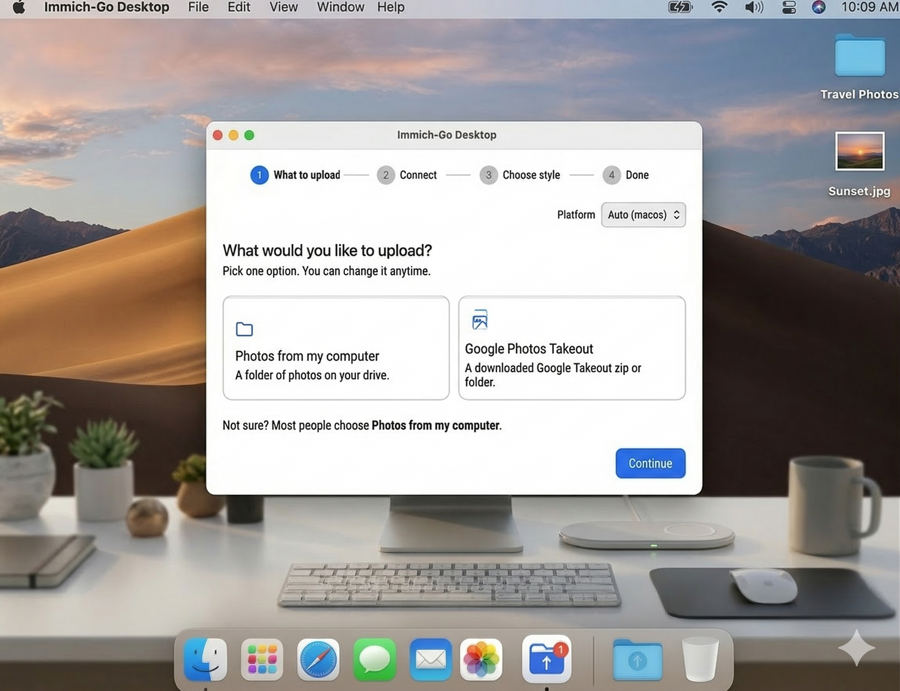

# immich-go-desktop

[](https://opensource.org/licenses/MIT)
[](https://blickoneblickytwo.github.io/immich-go-desktop/)
[](https://github.com/blickoneblickytwo/immich-go-desktop/stargazers)
[](https://github.com/simulot/immich-go)
[](https://github.com/immich-app/immich)



**A friendly, no-command-line-needed way to import your photos into Immich.**

[Launch the App](https://blickoneblickytwo.github.io/immich-go-desktop/) · [Report a Bug](https://github.com/blickoneblickytwo/immich-go-desktop/issues) · [Request a Feature](https://github.com/blickoneblickytwo/immich-go-desktop/issues)

---

## Who is this for?

If you've ever opened a terminal to run an immich-go command and immediately felt lost - this is for you.

I built this while migrating my own photo library. The tool that does the actual importing (immich-go) is great, but figuring out the right command to run is a real barrier if you're not a developer. One wrong flag or a typo in your server URL and things go sideways fast.

This app removes all of that. You click through a few steps, it builds the command for you, and you paste it into your terminal and run it. That's it.

---

## How it works

1. Open the [live app](https://blickoneblickytwo.github.io/immich-go-desktop/) - nothing to install
2. Pick what you're importing (a folder, a Google Takeout, an iCloud export, or another Immich server)
3. Enter your Immich server URL - your API key is **optional** (there's a test button, or skip it and fill your key in later, in your own terminal)
4. Point it to your photos and choose how to handle them
5. Copy the generated command and paste it into your terminal

---

## What it does and doesn't do

This app **generates the command** for you. The actual importing is still done by immich-go running in your terminal - this just means you never have to write the command yourself.

It supports the main immich-go import sources:

- 📁 **A folder** on your computer
- 📦 **A Google Photos Takeout** (zip or extracted folder, with wildcard support)
- 🍎 **An Apple iCloud export**
- 🔁 **Another Immich server** — server-to-server migration

You'll need immich-go installed to run it. If you haven't installed it yet, follow the [immich-go installation guide](https://github.com/simulot/immich-go). This app is verified against **immich-go v0.32.0** and works with **Immich v3.1.0** (the current release) — the commands it generates and the optional connection test are both unaffected by the v3.1 update.

The gear icon in the title bar opens **Settings**, with Privacy, Help (API key permissions, reading immich-go's output), and About tabs.

---

## Your data stays private

**You don't even have to type your API key in.** Leave it blank and the generated command contains `YOUR_API_KEY` for you to fill in yourself, in your own terminal - your key never touches this page at all.

If you do enter it, **it never leaves your browser** except for one thing: if you click **Test connection**, it's sent straight to the server URL *you* typed in - nowhere else. Skip the test and it isn't sent anywhere at all; it only ever ends up in the command text on your screen.

A few more specifics:

- **No backend.** This is a static page. There's no server behind it, no analytics, no logging - nobody sees what you type, including me.
- **Local storage only if you ask for it.** Ticking "Remember on this device" saves your server URL (and key, if you entered one) in your browser's local storage, on your machine. Nothing is uploaded.
- **Don't take my word for it.** The code is open source (MIT) - read exactly what it does, or open your browser's dev tools, go to the Network tab, and watch while you use it. You'll see nothing go out except that one optional test.
- **Want zero trust required?** [Run it locally](#run-it-locally-optional) - same code, on your own machine.

The in-app **Settings → Privacy** tab has the same information for quick reference.

---

## Run it locally (optional)

You don't need to install anything to use the app - just open the link above. But if you want to run it offline:

```bash
git clone https://github.com/blickoneblickytwo/immich-go-desktop.git
cd immich-go-desktop
npm install
npm run dev
```

It's a frontend-only app built with Vite + React.

---

## FAQ

**What API key permissions do I need?**
Easiest: grant your key all permissions when you create it in Immich. If you'd rather scope it down, immich-go's actual minimal set is `asset.read`, `asset.statistics`, `asset.update`, `asset.upload`, `asset.copy`, `asset.delete`, `asset.download`, `album.create`, `album.read`, `albumAsset.create`, `server.about`, `stack.create`, `tag.asset`, `tag.create`, `user.read`. Add `job.create` and `job.read` (on an admin-linked key) only if you want Immich's background jobs paused during upload. See [immich-go discussion #1032](https://github.com/simulot/immich-go/discussions/1032) for the source. This list is also copyable from the in-app **Settings → Help** tab.

**What does "WARNING: N assets did not reach a final state" mean?**
Usually harmless. It commonly shows up with Google Takeout exports split across multiple zip files, where immich-go's internal bookkeeping counts an asset as "pending" even though it uploaded fine. Check your Immich library first - if your photos are there, you're done. Only dig further if photos are genuinely missing.

---

## Recent Updates

Curious about the latest improvements (like the fully optional API key, the new Settings dialog, and a connection test that never blocks you)? Check out the [Changelog](CHANGELOG.md) for a full list of recent changes.

---

## Want to help?

This is an open source project and contributions are very welcome! A few areas where help would be especially appreciated:

- **Standalone desktop app** - wrapping this into a proper Mac/Windows/Linux app (Electron, Tauri, or similar) so users don't need to touch the terminal at all. If this sounds like something you could help with, please open an issue or reach out.
- **UI improvements and accessibility**
- **Support for more immich-go flags**
- **Testing across different setups**

Even if you just find a bug or have a feature idea, opening an issue is a huge help.

---

## License

MIT - use it however you want.
